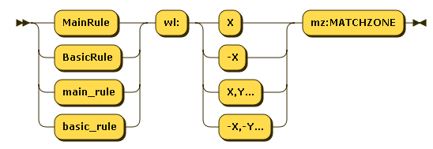
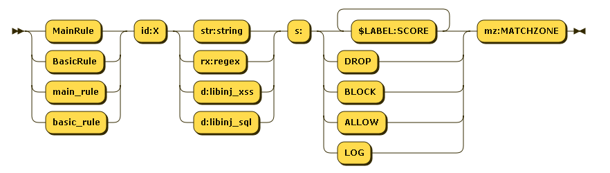
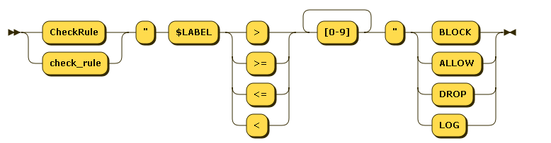
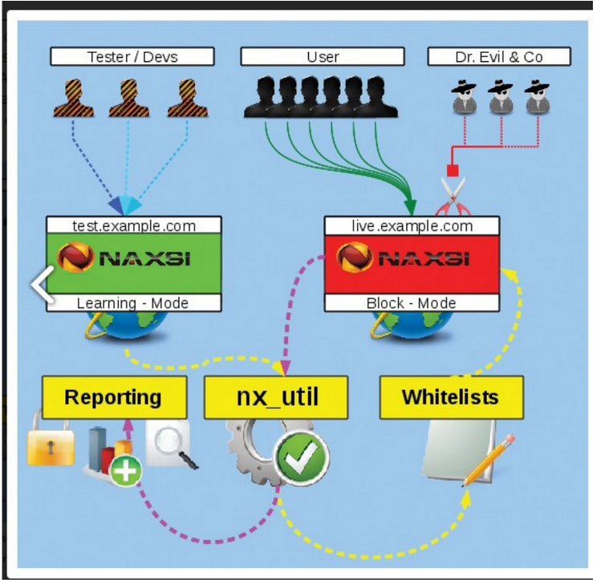

# NAXSI

## Giới thiệu

NAXSI là module phát triển dành riêng cho Nginx, NAXSI là viết tắt của **Nginx Anti XSS and SQL Injection**. NAXSI có rules đa dạng, tốc độ xử lý nhanh.

NAXSI tự động đọc và phân tích các POST và GET request gửi đến webserver. Nếu phát hiện các dấu hiệu khả nghi, như chứa các string liên quan đến SQL Injection, XSS, thì tự động block các request từ IP đó, cách block là redirect truy cập sang một địa chỉ URL khác.

## Whitelist



Whitelists dùng để chỉ cho naxsi bỏ qua 1 số parten nhất định để hạn chế FP . Ví dụ: cho phép dấu ' trong trường `term` tại url /search : `BasicRule wl:1013 "mz:$ARGS_VAR:term|$URL:/search";`

Whitelists có thể đặt ở `location level` (BasicRule) hoặc `http level` (MainRule). Whitelists có cú pháp như sau:

- wl:0 : Whitelist tất cả rule 
- wl:42 : Whitelist rule #42
- wl:42,41,43 : Whitelist rules 42, 41 và 43
- wl:-42 : Whitelist tất cả rule (>= 1000), trừ rule 42

**Lưu ý**: không thể trộn cả ID âm và dương vào cùng

Example: <https://github.com/nbs-system/naxsi/wiki/whitelists-examples>

## Rules



### ID (id:...)

id:num là số độc nhất dùng trong NAXSI_FMT hoặc whitelists.

ID dưới 1000 là để dành cho các internal rules (protocol mismatch etc.)

### Match Pattern**

Match pattern có thể là regular expression, chuỗi, or a call đến thư viện (libinjection) :

`rx:foo|bar` : will match foo or bar

`str:foo|bar` : will match foo|bar

`d:libinj_xss` : will match if libinjection says it's XSS (>= 0.55rc2)

`d:libinj_sql` : will match if libinjection says it's SQLi (>= 0.55rc2)

Ưu tiên sử dụng plain string nếu có thể vì sẽ nhanh hơn. Naxsi có match viết hoa và viết thường.

### Score (s:...)

**s** có thể tạo với tên chỉ định `s:$FOOBAR:4` sẽ tăng bộ đếm `$FOOBAR` đến 4. Một rule có thể tăng nhiều score lên, `s:$FOO:4,$BAR:8` sẽ tăng cả điểm `$FOO` lên 4 và `$BAR` lên 8. Điểm này dùng để thực hiện ACTION như `BLOCK/DROP` trong `CheckRule`

#### MatchZone (mz:...)

**mz** là match zone, dùng để xem phần nào của request

In rules, all matchzones but `$URL*:` are treated as OR conditions :

`MainRule id:4242 str:z "mz:$ARGS_VAR:X|BODY";`

pattern 'z' will be searched in `GET` var 'X' and all BODY vars.

`MainRule id:4242 str:z "mz:$ARGS_VAR:X|BODY|$URL_X:^/foo";`

pattern 'z' will be searched in GET var 'X' and all BODY vars as long as URL starts with `/foo`.

Starting from naxsi **0.55rc0**, for unknown content-types, you can use the `RAW_BODY` match-zone. `RAW_BODY` rules looks like that:

`MainRule id:4241 s:DROP str:RANDOMTHINGS mz:RAW_BODY;`

Rules in the `RAW_BODY` zone will only applied when:

- The Content-type is unknown (which means naxsi doesn't know how to properly parse the request)

- `id 11` (which is the internal blocking rule for 'unknown content-type') is whitelisted.

Then, the full body (url decoded and with null-bytes replaced by '0') is passed to this set of rules. The full body is matched again the regexes or string matches.

Whitelists for `RAW_BODY` rules are actually written just like normal body rules, such as:

`BasicRule wl:4241 "mz:$URL:/rata|BODY";`

1 số trường trong mz:

**URL** : Checks on the search pattern in the URL (server path).

**ARGS**: Searches for the pattern in the request arguments.

**FILE_EXT**: Tests the file attachment for the search pattern.

**BODY**: Checks the body of a POST request for the search pattern; can be further limited with `$BODY_VAR:VarName`.

**HEADERS**: Finds the search pattern in the header of a request can be further delimited: `$HEADERS_VAR:User-Agent, $HEADERS_VAR:Cookie, $HEADERS_VAR:Content-Type,$HEADERS_VAR:Connection, $HEADERS_VAR:Accept-Encoding.`

### Human readable message (msg:...)

msg là ghi chú để người đọc được

### Negative Keyword (negative)

negative là từ khóa để negative rule. Score sẽ tăng nếu rule không match :

`MainRule negative "rx:multipart/form-data|application/x-www-form-urlencoded" "msg:Content is neither mulipart/x-www-form.." "mz:$HEADERS_VAR:Content-type" "s:$EVADE:4" id:1402;`

## Checkrules



CheckRules xử lý các hành động như (LOG, BLOCK, DROP, ALLOW) dựa trên các điểm từ rule ở trên

```config
CheckRule "$SQL >= 8" BLOCK;
CheckRule "$RFI >= 8" BLOCK;
CheckRule "$TRAVERSAL >= 4" BLOCK;
CheckRule "$EVADE >= 4" BLOCK;
CheckRule "$XSS >= 8" BLOCK;
```

### Example

`MainRule "str:/manager/html/upload" "msg:DN SCAN Tomcat" "mz:URL" "s:$UWA:8" id:42000217;`

`MainRule "rx:type( *)=( *)[\"|']symbol[\"|']" "msg:DN APP_SERVER Possible RAILS Exploit using type=symbol" "mz:BODY" "s:$ATTACK:8" id:42000233;`

`MainRule "str:basic ywrtaw46ywrtaw4=" "msg:APP_SERVER Tomcat admin-admin credentials" "mz:$URL/manager|$HEADERS_VAR:Authorization" "s:$ATTACK:8" id:42000216;`

`MainRule "str:http://" "msg:http:// scheme" "mz:ARGS|BODY|$HEADERS_VAR:Cookie" "s:$RFI:8" id:1100 ;`

`MainRule "str:/*" "msg:mysql comment (/*)" "mz:BODY|URL|ARGS|$HEADERS_VAR:Cookie" "s:$SQL:8" id:1003 ;`

## DeniedUrl

DeniedUrl là URL trả về khi client bị block

`DeniedUrl "/RequestDenied";`

## Chế độ hoạt động của NAXSI


